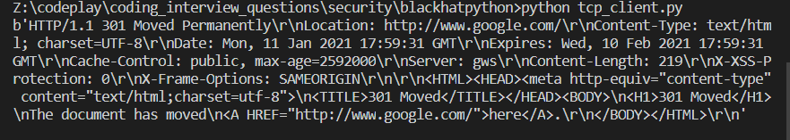
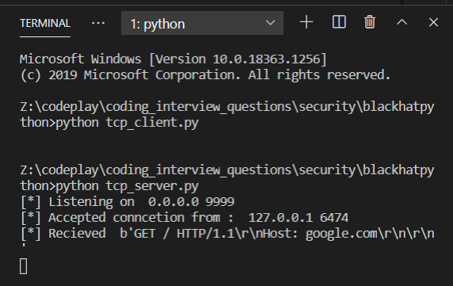

# BLACK HAT PYTHON 

## Chapter 1

Setting up python

## Chapter 2 Networking basics

Using socket programming:

using tcp_Server

Netcat program made page 16. needs review and execution. "kicking the tires". Or skip socket for now and startwith paramiko.