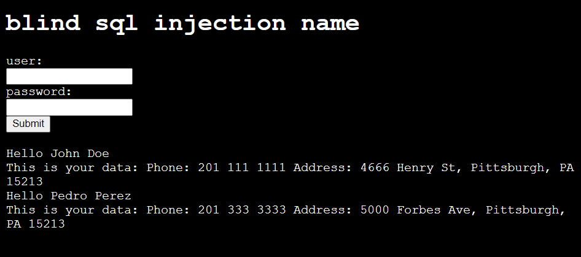
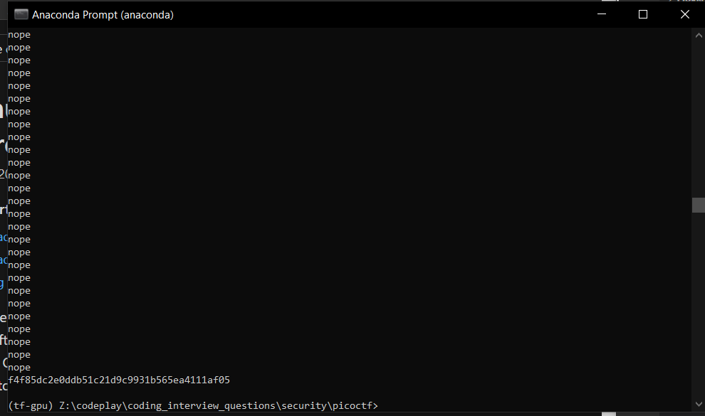

# PicoCTF from Carnegie Mellon

## PicoPrimer


Shell commands cheatsheet -  https://www.git-tower.com/blog/command-line-cheat-sheet/

Cross site scripting clarification : when we use a pregenerated cookie to authorise ourselves on the site.

### Symmetric Crypto example using AES

The most common versions are AES 128 and AES 256, which have a key length of 128 bits and AES 256 respectively. AES algorithm is considered secure. However, the implementation can be attacked successfully if it has flaws. For example, one famous way to break AES encryption is the Padding Oracle Attack,

ECB means Electronic Code Book. In this operation mode we encrypt independently blocks of the clear text according to the key length. For example, if we are using AES 128, we break the clear text in chunks of 128 bits and use AES to encrypt them independently.

A more secure operation mode is CBC, which means Cipher Block Chaining. In this mode we include additional elements. The first one is the initialization vector, a random value with the same size as the key. In AES, the key size is the same as the block size. Remember that in AES we must separate the cleartext in blocks with the same size as the key. Before starting the encryption, we do XOR between the first block of cleartext and the Initialization Vector, then we begin to encrypt using AES with the key of our choice. The initialization vector is different for every message, so if we send the same message twice, it will be different due to the initialization vector. We must attach the initialization vector to the message. Another element we add in this operation mode, is that we do not encrypt blocks independently, but we use the encrypted text from one block and XOR it with the next block of cleartext we want to encrypt.

In AES there is a common way of padding, which is a standard called PKCS #7. In AES 128, as we said previously, the block size is 128 bits, which is equivalent to 16 bytes. PKCS contains padding.

### Asymetric crypto example : RSA

In RSA, the public key is a pair of numbers, as well as the private key. The message can be anything that we can represent as a number. In a computer, everything is a number as we know. The encrypted text, also called ciphertext, will be another number. In summary, this what we need in RSA to encrypt and decrypt:

RSA public key: Is a pair of numbers (e,n)

RSA private key: Is a pair of numbers (d,n)

Message: m

Ciphertex: c

To encrypt: me mod n = c

To decrypt: cd mod n = m

RSA is only secure when large values are used. By 2019, RSA is considered secure only if the key is a number that would take at least 2048 bits. Which is roughly 617 digits. This is how it looks as a 617 digit number:

```python
639792933441952154134189948544473456738316249934191318148092777710386387734317720754565453220777092120190516609628049092636019759882816133231666365286193266863360627356763035447762803504507772355471058595487027908143562401451718062464362679456127531813407833033625423278394497538243720583531147711992606381334677687969597030983391307710987040859133746414428227726346594704745878477872019277152807317679077071572134447306057007334924369311383504931631284042512192565179806941135280131470130478164378851852909285452011658393419656213491434159562586586557055269049652098580338507224264829397285847831630577775606888764
```

### The Network

Application layer: Responsible for handling data traffic between applications. HTTP belongs to this layer; HTTP protocol is commonly used to obtain Web Pages.

Transport layer: Responsible for providing several connections on the same host, that means that you can have several applications on the same device and each of them can have a different connection even if it is just one device. It also defines functionalities for reliable transport. Two protocols are used on this layer. TCP (Transport Control Protocol). You use this protocol when you need to have reliable transport, this makes sure that if a piece of information was missing while being transfertransferred it is resent. HTTP from the Application layer, runs on top of TCP, because when you visit a Web Page you want to have every part of it accurately. On the other hand, when you don’t need reliable transport, but you want faster transport that does not resend parts that were missing, UDP (User Datagram Protocol) is used. An example when UDP is needed is for voice communication. When you are talking if a little part of the audio is missing, you do not want it to appear later in the communication because that would confuse the listener. The listener can still understand what you are saying if the part missing is small enough. Since UDP has no controls for transport, it is faster than TCP. This layer assigns a port to each connection, and that is how it tells the difference between connections in the same computer, because of the port.

Network layer: It provides devices with an address in the network called the IP (Internet Protocol) address, and routes information through different routers. It provides mapping between all the computers connected to the internet. When you connect to a network in some specific place, an IP is assigned to your device.

Data link layer: It provides communication between devices that are connected directly. Examples of protocols in the data link layer are Ethernet or WiFi. You generally use WiFi to send messages to your router directly without any other devices in between. Each device has a physical address in wifi or ethernet, known as the mac address. The mac address is used for this layer. This is not an address like the IP that can change depending on the network you are connected to. The mac address is assigned to the hardware of your network card when it is manufactured.

Physical layer: This handles electrical pulses on the wire that represent bits.

Wireshark tips
    1. using `http` to filter traffic
    2. to sniff wifi using monitor mode
    https://wiki.wireshark.org/HowToDecrypt802.11\

Infiltrating a database

"SELECT * FROM user where name='".$name.""' and password='".$password.""';"

`'1 or '1'='1`



Sql when blind:



bruteforce result: f4f85dc2e0ddb51c21d9c9931b565ea4111af05

### C features

C compiles fully.

activate wsl for windows from here:
https://docs.microsoft.com/en-us/windows/wsl/install-win10#simplified-installation-for-windows-insiders

to install gcc.


